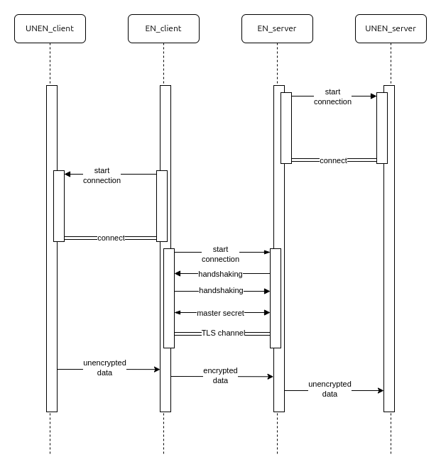
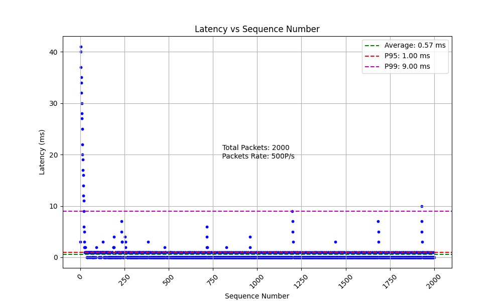
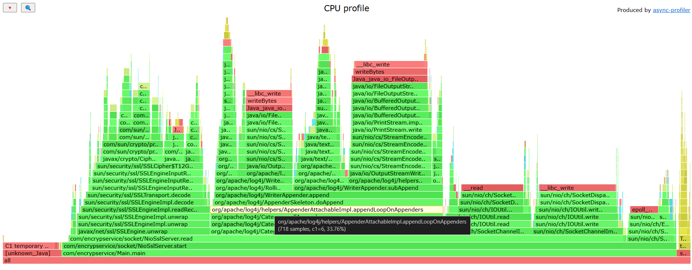
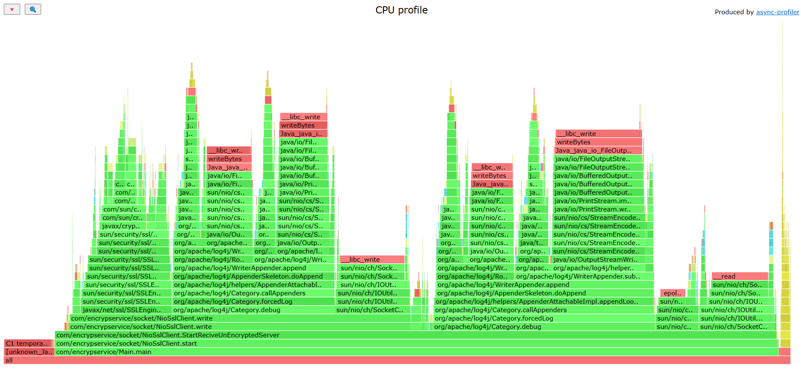
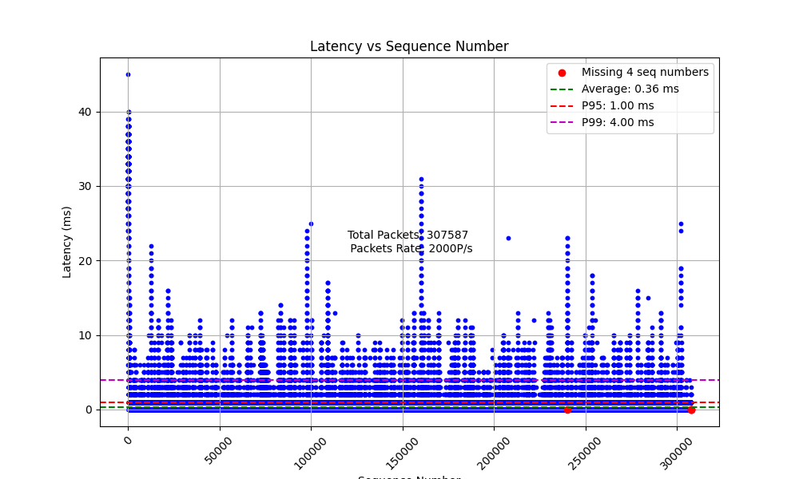
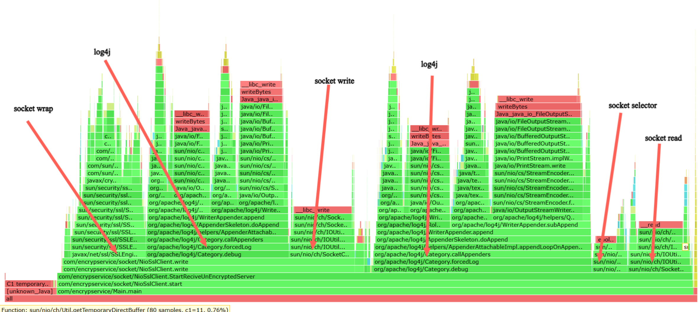
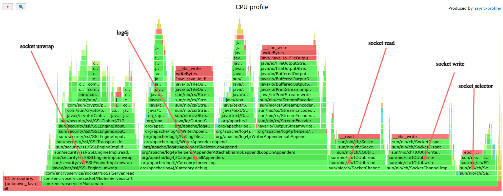

# Encrypto
### description
This is Tool for encrypting and decrypting between different sockets. It uses a SSL connection to encrypt and decrypt the data which get From Unencrypted socket and send it to Encrypted socket and then receive the encrypted data and send it to Unencrypted socket it act as a bridge between the two sockets.

### Flow


+ data send from Unencrypted Client to Encrypted Client
+ Encrypted Client encrypt the data and send it to Encrypted Server
+ Encrypted Server decrypt the data and send it to Unencrypted Server


### How that Work Behind the Scene
1. First, we need to create a keystore and truststore for the server and client , we can make that using `generatetlsfiles.sh` script.
    ```bash
    ./generatetlsfiles.sh
    ```
    This script will generate the keystore and truststore for the server and client, but what is key store and trust store?
    + Key store: is a file that contains the private key and the certificate ( public key + identity) of the client or server.
    + Trust store: is a file that contains the certificate of the other party (client or server) that we trust.
    the Trusted Certificate of server or client is the certificate have public key and identity of the other party as well as signature of the certificate authority (CA) that we trust.
    + signature of the certificate authority (CA) is a signature of the certificate authority that we trust, this signature is used to verify the certificate of the other party, but how certificate authority (CA) sign the certificate of the other party?
    + Certificate authority (CA) sign the certificate of the other party using its private key, and the other party can verify the signature using the public key of the certificate authority (CA) that we trust.

2. Then we need to create a SSLContext for the server and client, the SSLContext is used to create a SSLSocketFactory and SSLServerSocketFactory, the SSLSocketFactory and SSLServerSocketFactory is used to create a SSLSocket and SSLServerSocket, the SSLSocket and SSLServerSocket is used to create a SSL connection between the server and client, but in our case we used virtual thread (selectable channel) to create a SSL connection between the server and client and that method not compatible with SSLSocket and SSLServerSocket, so we need to create a SSLEngine for the server and client, the SSLEngine is used to create a SSL connection between the server and client using virtual thread (selectable channel).

3. Then we need to create a SSL connection between the server and client, the SSL connection is created using the SSLEngine, the SSLEngine is used to create a SSL connection between the server and client using virtual thread (selectable channel).

the hardest part in this project is to create a SSL connection between the server and client using virtual thread (selectable channel) because the SSLEngine is not compatible with virtual thread (selectable channel) so we need to create a SSLEngine that is compatible with virtual thread (selectable channel) and implement handshake and wrap and unwrap methods for the SSLEngine, fortunately, I found a [github repository](https://github.com/alkarn/sslengine.example) that has a abstract class that implement the SSLEngine handshake and wrap and unwrap methods for virtual thread (selectable channel) and I used that class in my project


> when you run encrypto server or client you should run them in directory that contains the keystore and truststore files.


### How to use
1. First you need to install the deb package or binary file from release page.
    ```bash
    dpkg -i encrypto.deb
    ```
2. Then you need to run the unencrypted server we can use netcat for that.
    ```bash
    nc -l 127.0.0.1 9001
    ```
3. Then you need to run the encrypted server.
    ```bash
    encrypto server 9002 127.0.0.1 9001
    ```
    `server` is mode type

    `9002` is the port of the encrypted server

    `127.0.0.1` is the ip of the unencrypted server

    `9001` is the port of the unencrypted server

4. Then you need to run the encrypted client.
    ```bash
    encrypto client 9003 127.0.0.1 9002
    ```
    `client` is mode type

    `9003` is the port of the encrypted client

    `127.0.0.1` is the ip of the encrypted server

    `9002` is the port of the encrypted server
5. Then you need to run the unencrypted client.
    ```bash
    nc 127.0.0.1 9003
    ``` 
6. Now you can send data from the unencrypted client and it will be encrypted and send to the unencrypted server and vice versa.

### Compilation

We can compile java code to jar file using maven.
```bash
mvn clean package
```
but to compile the native code we need to use the following command.
```bash
mvn clean package -Pnative
```
this will use the GraalVM to compile the native code to binary file.

GraalVM is a high-performance runtime that provides significant improvements in application performance and efficiency which is used to compile the native code to binary file.

we use this binary file to create a deb package using github action which trigger when we create a new version of the project , so when pipeline work it will make this steps:

+  compile the native code to binary file
+  create a deb package from the binary file
+  upload the deb package to the release page

### performance
after successfully running the encrypted server and client we need to test the performance of the encrypted server and client, so first measure the latency of the encrypted server and client , we using Tshark to capture the packets between the encrypted client and non-encrypted client so we can use tshark 
```bash
sudo tshark -i lo -f "tcp port 9003" -Y "tcp and not tcp.len == 0" -T fields -e frame.time_epoch -e tcp.seq -e data.text -o data.show_as_text:TRUE -a duration:100 > capture_port_9003.txt
```
`tshark` is a command-line tool that is used to capture the packets between the encrypted client and non-encrypted client.

`-i lo` is the interface that we want to capture the packets from.

`-f "tcp port 9003"` is the filter that we want to capture the packets that have the destination port 9003.

`-Y "tcp and not tcp.len == 0"` is the filter that we want to capture the packets that have the tcp protocol and the length of the packet is not equal to 0 , excluding ack packets.

`-T fields` is the format of the output.

`-e frame.time_epoch` is the field that we want to capture.

`-e tcp.seq` is the field that we want to capture.

`-e data.text` is the field that we want to capture.

`-o data.show_as_text:TRUE` is the option that we want to show the data as text.

`-a duration:100` is the option that we want to capture the packets for 100 seconds.

`> capture_port_9003.txt` is the output file that we want to save the captured packets in, output file is a text file that contains the captured packets.
```txt
1731238961.080041539	1	05fe2356-f89b-4ab9-86d7-c41e141a4c15
1731238961.100026179	37	c576ed8a-8e8a-4cbc-b5f1-84bfe005632c
1731238961.116574179	73	8ea3c408-55de-48b5-a38c-9db85af44553
1731238961.136793061	109	b922e865-ff29-4cc7-a7a5-94bc043da667
1731238961.154405711	145	70c8f8a2-033a-42d9-abd5-bf4b9bd7c3f0
```
we capture the packets which recived by encrypted client and unencrypted server then we can calculate the latency by subtract the time of the packet that recived by encrypted client from the time of the packet that recived by unencrypted server.

### Seq number problem
when we capture the packets between the encrypted client and non-encrypted server we found that the sequence number of the packets that received by the encrypted client is different from the sequence number of the packets that received by the non-encrypted server, that happens because the seq number only attached between two connection only so we can spend package with seq (5) from the unencrypted client to the encrypted client and the encrypted client will send the package with seq (6) to encrypted server then encrypted server send it wit seq (7) to unencrypted server so we can't calculate the latency by subtract the time of the packet that recived by encrypted client from the time of the packet that recived by unencrypted server because the seq number is different so we need to find another way to map the packets between the encrypted client and non-encrypted server.


### Solution
we can solve this problem by adding a `uuid` to the data that we send from the unencrypted client to the encrypted client which will send it end to unencrypted server so we can map the packets between the encrypted client and non-encrypted server by the unique id that we added to the data.

but when increase rate of messages which send (message/sec) it make some problems like merge many message in only one message this happend because of many reasons 
+ Nagle's algorithm : nagle's algorithm  is a means of improving the efficiency of TCP/IP networks by reducing the number of packets that need to be sent over the network
+ TCP is a Stream Protocol: TCP is a byte-stream protocol, which means that it treats the data sent across a connection as a continuous stream of bytes. It doesn’t understand or enforce any message boundaries. When you write messages to the socket, they may be combined into a single buffer if they arrive close together.

+ Buffer Accumulation: If multiple messages arrive before you read from the buffer, they can accumulate together in the buffer. When you read from it, you get a chunk of data that may contain multiple messages or even partial messages.

+ Reading and Parsing Logic: If your reading logic doesn't parse and separate messages, you may end up with a merged string of messages in a single read. Without a clear delimiter or length prefix, it becomes challenging to identify where one message ends and the next one begins.

so packet will be like that after set "$" as separator
```txt
>1731238961.080041539	1 05fe2356-f89b-4ab9-86d7-c41e141a4c15$c576ed8a-8e8a-4cbc-b5f1-84bfe005632c$
>1731238961.116574179	73	8ea3c408-55de-48b5-a38c-9db85af44553
?1731238961.136793061	109	b922e865-ff29-4cc7-a7a5-94bc043da667$70c8f8a2-033a-42d9-abd5-bf4b9bd7c3f0$
```
so we should add repair tool which fixes this file before comparing two files by extract many uuid in same line to separate line we implement all this in `generatetlsfiles.sh`, now we have two files have all packets sent and received now we will try to mapped and generate graph show latency and missing packet , will be like that 

show `Total packet` & `Packet Rate` & `average` & `P95` & `P99`

### Profiler
we want make profiler to know all execution code done when data is process (logs + encryption + decrytion + all system call + others)

We use [async-profiler](https://github.com/async-profiler/async-profiler) to profile java app and genrate flamgraph like that (one for client process & other for server process )




to run mointoring script just run `start.sh` in `monitoring` dir the enter profileing duration time which will set to `tshark` & `async-profiler` to monitor application process
```bash
@youssefshibl ➜ /workspaces/encrypto-/monitoring (main) $ ./start.sh 
Enter Monitoring Time (default: 100): 15
Enter Packet Number Per Scond (default: 500 p/s): 500
Enter Time duration for the test (default: 5s): 4
Netcat started with PID: 19372
Server started with PID: 19411
Client started with PID: 19456
Client monitor started with PID: 19527
Server monitor started with PID: 19528
Server profiler started with PID: 19529
Client profiler started with PID: 19530
Running as user "root" and group "root". This could be dangerous.
Running as user "root" and group "root". This could be dangerous.
Capturing on 'Loopback: lo'
Capturing on 'Loopback: lo'
Connected to server 127.0.0.1 on port 9003
1808 Connection closed.
Waiting for client to finish
1980 

Plot saved as 'latency_vs_seq_number.png'
### Monitoring Complete ###
./start.sh: line 1: kill: (19527) - No such process
./start.sh: line 1: kill: (19528) - No such process
./start.sh: line 1: kill: (19529) - No such process
./start.sh: line 1: kill: (19530) - No such process
```

### Profile Examples

#### profile_time=200s , packet_rate=2000p/s , trafic_time=160
```bash
@youssefshibl ➜ /workspaces/encrypto-/monitoring (main) $ ./start.sh 
Enter Monitoring Time (default: 100): 200
Enter Packet Number Per Scond (default: 500 p/s): 2000
Enter Time duration for the test (default: 5s): 160
```


client_test.py script may take time greater than 200s to send all traffic so if profile_time finishes before send all traffic it stop sending traffic so may not reach the target number of traffic ,Flamgraph for Client

Flamgraph for Server

As you see log4j takes more CPU utilization  so the next optimization will try to refactor this issue 


##  Deb package Pipeline
I am making a GitHub action pipeline that compiles code to binary using [GraalVM](https://www.graalvm.org/) after that copy the new version to `encrypto` dir (deb dir) then build the package 
```bash
dpkg-deb --root-owner-group --build encrypto
```
then release the package with binary 


